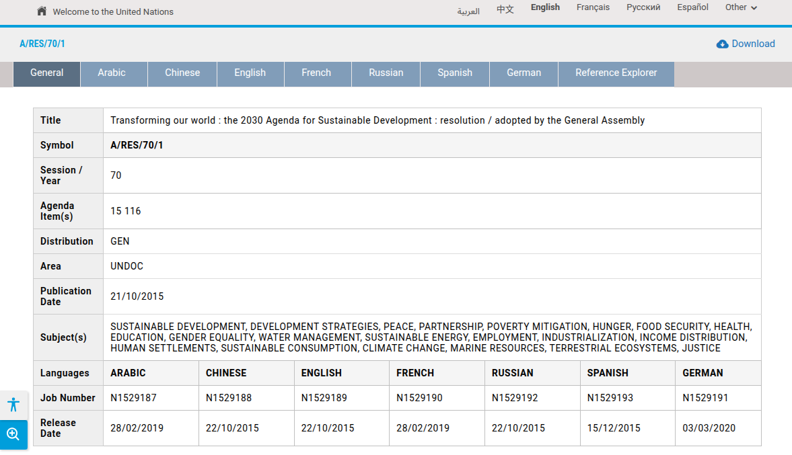

# Data

Policymakers often face considerable obstacles when working with concepts that are highly contextual and domain-dependent. Terms related to religion and spirituality are particularly difficult, as their meanings shift across healthcare, humanitarian work, diplomacy, education, and development. Nowhere is this complexity more evident than in the United Nations (UN) system, where these topics repeatedly surface in global policy discussions.

Despite the relevance of these materials, accessing UN documents remains challenging. The official UN archives contain an extensive collection of resolutions, reports, and policy texts issued by bodies such as the Security Council, General Assembly, and ECOSOC, but they are dispersed across outdated or fragmented search interfaces. Additional organizations within the UN system, including WHO and UNESCO, maintain their own independent archives, further complicating navigation.

For researchers and practitioners interested in nuanced topics such as religion and spirituality, these barriers are especially acute. Queries often return large volumes of irrelevant texts filled with procedural formalities, boilerplate language, and repeated phrases that match keywords but not meaning. Extracting actionable insights frequently requires time-consuming manual review of thousands of documents.

<figure><figcaption>
<strong>An example resolution document that is both health- and education-related. Screenshot taken from the</strong> <strong>website of UN Official Document System. SpiritRAG is built on the top of 7,500+ UN resolution documents, parallel in all six UN official languages plus German.</strong> 
</figcaption></figure>

We use UN resolution documents as the foundation for SpiritRAG precisely because they represent one of the most authoritative, globally negotiated sources of policy language in areas where spirituality, human well-being, and social development intersect. At the same time, these documents exemplify the practical challenges faced by scholars and policymakers: they are rich in content but difficult to search, interpret, and contextualize.

SpiritRAG addresses this gap by providing a system capable of retrieving, synthesizing, and generating knowledge from these materials with domain sensitivity. By grounding language models in the UN’s policy corpus, we enable precise, context-aware exploration of complex concepts and offer users a more accessible pathway to reliable information.
