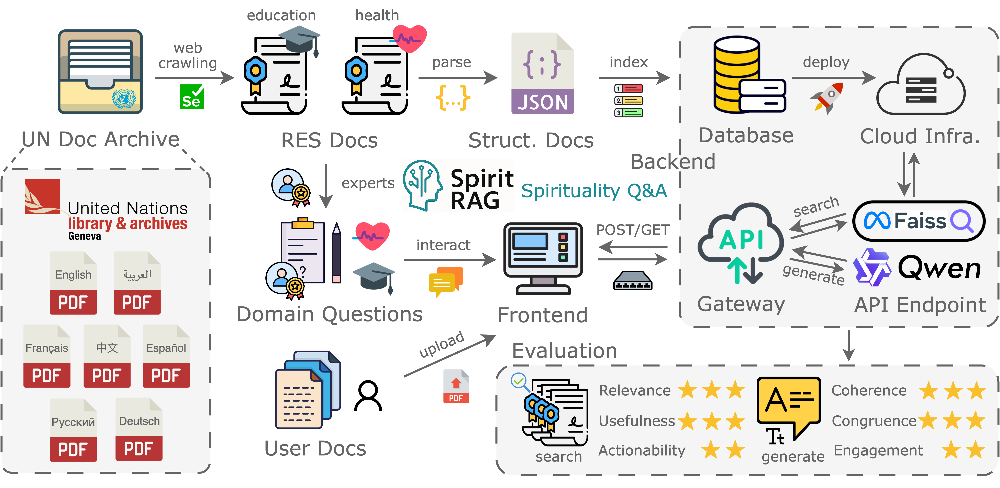

# Engineering

Below is the overall pipeline of SpiritRAG, designed to be customizable, scalable, light-weight and modular.&#x20;

Although SpiritRAG was developed based on religion and spirituality and a corpus of UN policy documents, it is designed to be _**easily applied to any other domain and dataset.**_

<figure><figcaption></figcaption></figure>

### Workflow

1. Our workflow begins with large-scale acquisition of UN policy documents. Using a Selenium-based browser simulator, we crawled the UN Documents Archive and downloaded the relevant resolutions in PDF format. A high-recall keyword strategy ensured that we captured documents across the full range of domains where spiritual and value-related concepts appear.
2. All collected PDFs were then processed with [**Docling**](https://docling.ai/), a GPU-accelerated PDF parsing framework. This allowed us to convert each document into a structured JSON representation, making it straightforward to segment, index, and store the corpus for efficient retrieval.
3. The entire system—corpus, backend, and frontend—was subsequently deployed on [**ScienceCloud**](https://www.zi.uzh.ch/en/teaching-and-research/science-it/computing/sciencecloud.html), the secure research infrastructure of the University of Zurich, ensuring scalability, reliability, and maintainability.

SpiritRAG integrates recent advances in large language models for both information retrieval and answer generation. For a detailed description of our pipeline, model configuration, and evaluation, we refer you to our EMNLP 2025 paper linked below.


