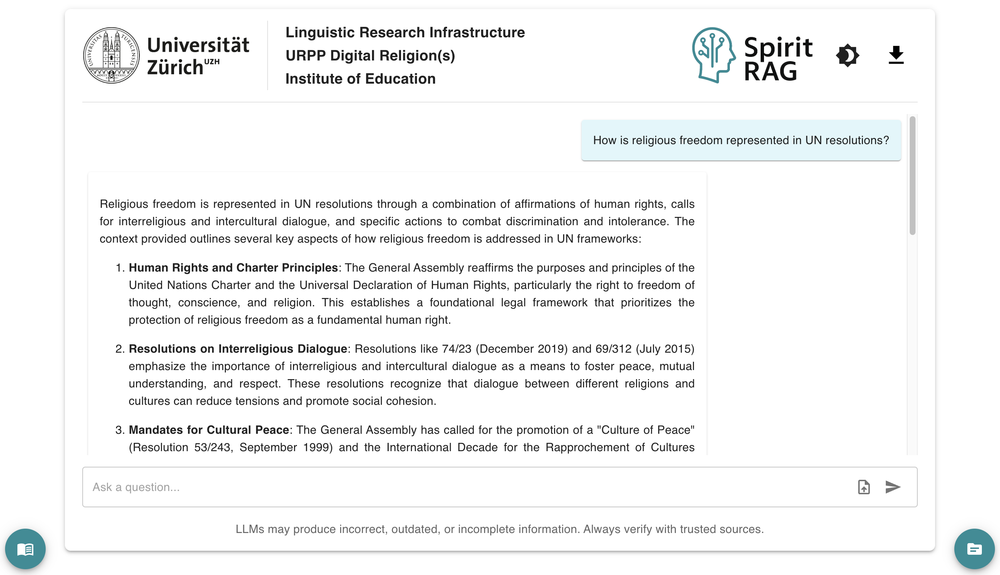

# Features

You can ask SpiritRAG any question related to religion and spirituality in the context of health and education, and it will generate an answer grounded in the source documents (see [Data](data.md)).

<figure><figcaption>
Front end of SpiritRAG
</figcaption></figure>

* Click the folder icon in the lower‑right corner to view the **list of source documents** used to generate the answer. An extra toggle is also provided for **evaluation** purposes.
* Select any of the available language options to **open the corresponding PDF** directly in the left‑hand pane.
* **Filter documents** by year and subject using combinatory logics:
  * refugees, right to education -> filters documents that contain both subjects
  * refugees | right to education -> filters  documents that contain at least one subject
  * refugees, right to education -> filters documents that contain right to education but not refugees&#x20;
* Toggle **dark mode**

